# AKS AI Workloads

End-to-end examples for running AI/ML workloads on [Azure Kubernetes Service (AKS)](https://learn.microsoft.com/en-us/azure/aks/) with GPU acceleration, powered by [KubeRay](https://docs.ray.io/en/latest/cluster/kubernetes/index.html) and [Karpenter](https://karpenter.sh/).

## Architecture

This repository demonstrates a **hybrid multi-cloud architecture** where an AKS control plane manages GPU nodes across both Azure and [Nebius Cloud](https://nebius.com/), connected via VPN. All examples support both cloud providers through Kustomize overlays.



Key infrastructure components:

- **Flex Karpenter** for automatic node provisioning and autoscaling
- **Kubernetes DRA (Dynamic Resource Allocation)** with NVIDIA DRA driver for topology-aware GPU scheduling
- **NVIDIA H100 80GB** GPU instances on both Azure and Nebius
- **KubeRay** operator for managing Ray clusters on Kubernetes

## Examples

### LLM

| Example | Description |
|---|---|
| [Distributed Inference](examples/llm/inferencing/) | Benchmark LLM inference throughput and latency using Ray Data LLM with vLLM. Default model: Qwen2.5-7B-Instruct. |
| [Fine-Tuning](examples/llm/fine-tuning/) | LoRA SFT on Qwen2.5-7B-Instruct using Ray Train and LLaMA-Factory for entity recognition on the Viggo dataset. |

### Multimodal

| Example | Description |
|---|---|
| [Batch Inference](examples/multimodal/batch-inference/) | Generate CLIP image embeddings at scale using Ray Data with GPU actors, with cosine similarity search. |
| [Distributed Training](examples/multimodal/distributed-training/) | Train an image classifier on CLIP embeddings using Ray Train with PyTorch DDP and MLflow tracking. |

### Infrastructure

| Example | Description |
|---|---|
| [Autoscaling](examples/autoscaling/) | Karpenter node pool configurations for automatic CPU and GPU node provisioning on Azure and Nebius. |

Each example follows a consistent layout:

- `main.py` - Application entry point
- `run.sh` - One-command launcher
- `base/` - Kustomize base manifests (RayJob + DRA ResourceClaimTemplate)
- `overlays/{azure,nebius}/` - Cloud-specific Kustomize patches

## Prerequisites

- An AKS cluster with GPU node pools (NVIDIA H100 recommended)
- [KubeRay operator](https://docs.ray.io/en/latest/cluster/kubernetes/getting-started.html) v1.5.1+ installed
- NVIDIA DRA driver deployed for GPU scheduling
- [Karpenter](https://learn.microsoft.com/en-us/azure/aks/node-autoprovision) enabled (for autoscaling examples)
- `kubectl` and `kustomize` CLI tools

## Getting Started

1. Ensure your AKS cluster and prerequisites are configured.
2. Navigate to the example you want to run (e.g., `examples/llm/inferencing/`).
3. Review the example's README for specific configuration details.
4. Run the example:

```bash
# Example: LLM Inference on Azure
./examples/llm/inferencing/run.sh azure
```

Each example's `run.sh` script handles applying the Kustomize manifests and submitting the RayJob to the cluster.

## Technologies

| Category | Technologies |
|---|---|
| Cloud Platforms | Azure (AKS), Nebius Cloud |
| Distributed Computing | Ray 2.48–2.53, KubeRay, Ray Data, Ray Train |
| LLM Inference | vLLM, Ray Data LLM |
| LLM Fine-Tuning | LLaMA-Factory (LoRA SFT) |
| Models | Qwen2.5-7B-Instruct, OpenAI CLIP |
| ML Frameworks | PyTorch, HuggingFace Transformers |
| Experiment Tracking | MLflow |
| GPU Scheduling | Kubernetes DRA, NVIDIA DRA Driver |
| Autoscaling | Flex Karpenter |
| GPU Hardware | NVIDIA H100 80GB HBM3 |
